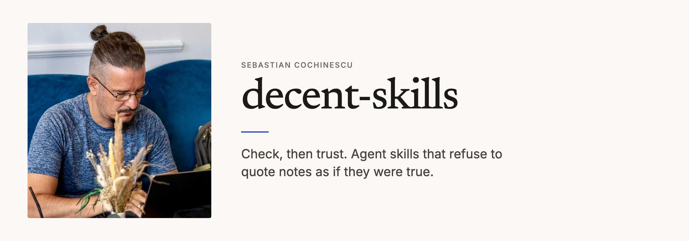

<p align="center">
  <picture>
    <source media="(prefers-color-scheme: dark)" srcset="assets/banner-dark.png">
    <source media="(prefers-color-scheme: light)" srcset="assets/banner-light.png">
    
  </picture>
</p>

# The three agent skills I built

I built these for the way I work, and published them. Public, MIT. They run in Claude Code, Codex, ChatGPT, and Grok. None of them start on their own. You type them.

[`/council-review`](./skills/council-review/SKILL.md) is the one I would keep if I could only keep one. It started as a pile of terminal windows: I pasted the same diff into four models, one at a time, and read back four opinions from four assistants that had each watched me write the code they were reviewing.

Now it is one command. Codex, Antigravity, and Grok get the same packet. They cannot see the repo. They cannot use tools. Claude orchestrates and is the only one allowed to look at the repo, so every finding gets checked against the real files. Nothing gets fixed until I say `fix`. A missing reviewer is less coverage, not a failed run.

The isolation is the whole design. A reviewer that sat next to you while you wrote the code agrees with you too easily. The name collides with Claude's `/code-review` and Codex's `/review`, but those run inside your session, on your tree. This one is three models that cannot touch it.

The method predates the skill. The same three reviewers, three rounds of them, went over the plan for the skill we took to the [GTM Skillathon](https://gtm-skillathon-2026-results.upb-alexander.chatgpt.site/) in August, Europe's first agent skill hackathon. It won first place out of the 34 that shipped that evening.

[`/wawa`](./skills/wawa/SKILL.md) came out of typing "where are we at, and what's next" a few dozen times a day. It reads the repo first, then `STATUS.md`. When the two disagree, that disagreement is the answer. Notes are hypotheses with a timestamp on them.

[`/init-repo-docs`](./skills/init-repo-docs/SKILL.md) is how I already split work everywhere else: decisions, todos, status. It writes `STATUS.md`, `TODO.md`, and `DECISIONS.md` from git history, planning docs, and my wiki, with the evidence traced. It does not commit.

<p align="center">
  
</p>

## Install

**Claude Code**

```bash
claude plugin marketplace add cochinescu/decent-skills
claude plugin install decent-skills@decent-skills
```

Then `/council-review`, `/wawa`, `/init-repo-docs`.

**Codex, ChatGPT, Grok**

```bash
git clone https://github.com/cochinescu/decent-skills.git
cd decent-skills
./install.sh
```

That puts `skills/*` into `~/.claude/skills/` and `~/.agents/skills/`. Symlink if it can, copy if it cannot.

One skill only:

```bash
cp -R skills/wawa ~/.agents/skills/
```

`with claude` also needs `agents/blind-reviewer.md` in `~/.claude/agents/`. The plugin install and `install.sh` both put it there; a hand-copied single skill does not. `install.sh` leaves an existing `blind-reviewer.md` alone rather than overwriting yours.

`/council-review` wants `codex`, `agy`, and `grok` on PATH for a full run. Default models: Codex `gpt-5.6-sol`, Antigravity `Gemini 3.1 Pro (High)`, Grok `grok-4.6`, and, when you add `with claude`, Claude `fable`. All four are pinned to their vendor's top tier. Change the pins if your account differs.

The orchestrator is whichever host you typed the command in. It is the only participant that reads the repo; every reviewer runs blind.

Claude is off by default for a reason. This command is normally typed in Claude Code, so Claude built the packet and usually wrote the code under review. That makes a Claude reviewer the least independent of the four, which is the exact failure the other three exist to avoid. Add `with claude` when you want it anyway.

## Also, not copied here

I also publish [anxiety-reset](https://github.com/Anima-Felix/anima-felix-agent-skills) from Anima Felix, and [agentmarkup](https://github.com/agentmarkup/agentmarkup). I do not copy them into this repo. Copies go stale, and the licences are not mine to flatten.

## License

[MIT](./LICENSE) · [Sebastian Cochinescu](https://cochinescu.com)
